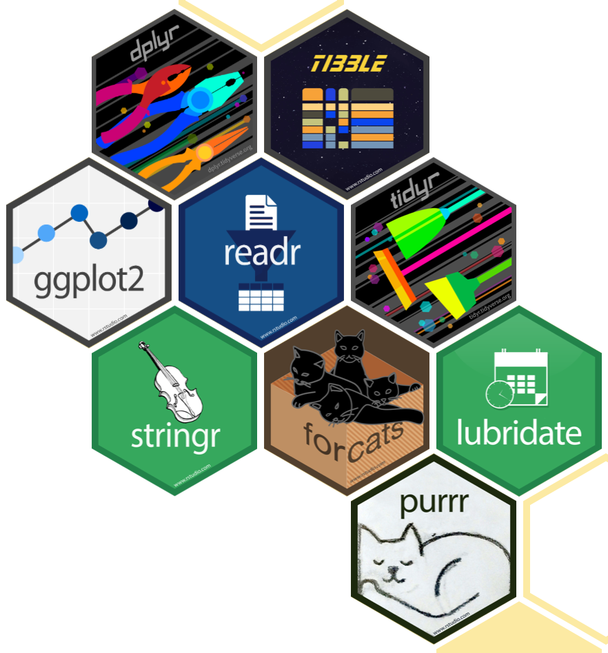

```{r}
#| echo: false
#| message: false
library(here)
library(cowplot)
```

The last class introduced important concepts in data science such as directory structure, working directories, projects, packages, and data. This lesson will dig deeper into working with data in R. We will cover quarto documents, data types, and data objects

::: callout-note
### Learning objectives

**At the end of this lesson you will be able to:**

- Generate and navigate a quarto document
- Recognize and create various data types in R
- Identify an object from a function in R
:::

# Welcome to Quarto

Read the [Quarto welcome tutorial](https://quarto.org/docs/get-started/hello/rstudio.html) to learn about some of the cool tools, such as `code-folding`, `echo=false`, and more.

- Read through Part 1: "Hello, Quarto"
- Read through Part 2: "Computations".
- Part 3 is more advanced for generating diverse outputs such as pdf documents feel free to explore, but we won't use these features.

# Packages

In the first class, we introduced packages in the RStudio panel and installed tidyverse which will be essential to a lot of the tasks we will do in the course as this package contains thousands of functions.

## What is a package?

In R, the fundamental unit of shareable code is the **package.** A package bundles together *code*, *data*, *documentation*, and *tests*, and is easy to share with others. There are tens of thousands of R packages that exist. Two main repositories of R packages exist. **CRAN** or the Comprehensive R Archive Network is the public clearing house for R packages and where you went to install R. **Bioconductor** is an open source project that develops and shares open source software for precise and repeatable analysis of biological data. It is this huge variety of packages that R is so successful because the chances are high that someone has already solved a problem that you’re working on.

## How to get a package?

To install packages from CRAN use the `install.packages()` function. Once the package is **installed** you can **load** the package using the `library()` function. Installing packages from Bioconductor take a few more steps which we won't cover just yet.

In Lecture 2, we will look at data from the `PalmerPenguins` package which is a very tidy and curated quarto document to see how you can incorporate narrative text, code, outputs, and more in a single document. I hope you will appreciate the utility of using Quarto to tell the story of the data analysis. The beautiful html outputs can easily be shared with others and helps build the logic of a data analysis pipeline from beginning to end.

Here are some description of packages we will use in class 02.

## Palmer Penguins


The [PalmerPenguins](https://allisonhorst.github.io/palmerpenguins/) package contains data about Antarctica penguins including their location, breed, and biological metrics.

## Tidyverse package



The [Tidyverse](https://www.tidyverse.org) which is a collection of R packages that share an underlying design, syntax, and grammer to streamline many main functions used in data science. You can install the complete tidyverse with `install.packages("tidyverse")`, once the package is installed you can load it using `library(tidyverse)`. We installed this in class 01, so if that worked in class you don't need to install it again.

We will go over more details about all the functions of the tidyverse package next class!

# Data Analysis Workflow

The BIG picture of what we do in data science. This will be the architecture of the data analysis pipeline we will build during the course. 

<figcaption>Figure 1: In our model of the data science process, you start with data import and tidying. Next, you understand your data with an iterative cycle of transforming, visualizing, and modeling. You finish the process by communicating your results to other humans.</figcaption>

## Data: What is it and how to we store and access it in R?

To get started a key concept is what the data looks like and what an **operation** or **function** is that can then be applied to the data. 
::: callout-important \## DATA TYPES

Remember these are the main types of data in R:

- character
- numeric
- integer
- factor
- logical :::

::: callout-tip
## DATA OBJECTS

Remember data can be stored in multiple types of objects:

- vector
- matrix
- data frame
- array
- list
:::

A **function** in `R` is indicated by have `()` after the command. For example, `mean()`, `sd()`, or `count()`, these are all functions that can be applied to data. But knowing what functions can apply to different types of data is important.

### Vectors

```{r}
#| label: vector.data

# A vector is like a series that is stored as a single object

# x is a vector of the numbers 1 to 26
x <- 1:26
x

# y is a vector of the letters a to z
y <- letters
y

# the arrow `<-` assigns the variables to an object (x or y) then we when print x or y we get the output.
# notice we don't use () anywhere as these are objects not functions

# we can examine the "class" of the objects using the class function
class(x)
class(y)
length(x)
length(y)

# class() is a function and is running an operation of the data object x and y. class uses () because it is a function or operation.
# as you can see x is a integer of whole numbers while y is a character vector

# we can also perform operations on these vectors
mean(x)


```

### Matrix and Data Frame

```{r}
#| label: df.data

# A matrix is like an excel document that has and rows and columns of data and all the data must be the same type of data
# this is a matrix with 10 rows and 5 columns

mat <- matrix(c(1:50), nrow = 10, ncol = 5)
mat

class(mat) # the mat data object is a matrix or array as shown by the class function
dim(mat)   
# we can ask about the dimensions of the matrix using the dim function, rows are always listed first, then columns


# a dataframe is a specialized matrix that has both numeric and non-numeric data
# we can combine the x and y vectors to create a data frame using the cbind (or column bind) function
z <- cbind(x,y)
z
class(z)

# note this still listed as a matrix!!

str(z)
# but if we look at the structure of the data using the str() function we can see it forced the integers to be characters so that all the data types would be the same. Its critical to understand how R is interpreting your data! 

# to keep the mixed datatype we use the data.frame() function
df <- data.frame(x, y)
df
class(df)
str(df)
# Now you can see the data.frame,df, has a column of integers and a column of characters.

```

### Lists

```{r}
# Lists are a special and highly flexible object in R. We won't cover them in much detail, but they can be very handy if your data doesn't fit the structure of a data frame or array. 

 number.list <- list(
      "a" = rnorm(n = 10),
      "b" = rnorm(n = 5),
      "c" = rnorm(n = 15))
 
number.list
class(number.list)
dim(number.list)
str(number.list)

# as you can see number.list is a "list" object
# the list doesn't have a dimension because its not in a dataframe shape
# number.list is a list of 3 numeric vectors of all different lengths named a, b, and c
# but a list can hold more than just vectors, it can store multiple dataframe or matrices or even arrays or other lists, altogether

test.list <- list(x,y,mat,df,number.list)
class(test.list)
test.list

class(number.list[[1]])
# We can get information on a specific item in the list

# however we can't perform operations without some modification.
mean(number.list)

# we have to perform a "loop" to apply the specified function to each item in the list. We will cover loops later on. 
# using the sapply() function we can apply the mean() function to each numeric vector in the list. 
sapply(number.list, mean)

```

### Arrays

Arrays are very powerful and widely used in analysis of genomics data because it can hold many different dataframes together but unlike a list they can be carefully organized as is useful in transcriptomics analysis. Transcriptomic data usually contains gene expression or count data with the rows as genes and the columns as samples. In addition relevant metadata is stored in which the samples are now the rows with relevant descriptive data as the columns. Moreover, the genes can also have corresponding metadata that is stored with the genes as the rows and the relevant metadata (such as chromosome, strand, start and end sequence, gene type \[microRNA, protein coding ...\], and more). An array can store or link all this information together with relevant R packages to also perform operations on them.

For example, we will look at the structure of some gene expression data

```{r}
#| echo: false
#| message: false

library(SummarizedExperiment)
counts <- read.csv("data/counts.csv", row.names = 1)
genes <- read.csv("data/gene_metadata.csv")
samples <- read.csv("data/sample_metadata.csv")
```

```{r}
head(counts)
head(genes)
head(samples)

se <- SummarizedExperiment(
  assays = list(counts = counts),
  colData = samples,
  rowData = genes)

se
class(se)

# the se object is a special type of array that is called a Summarized Experiment Class
# the se object has counts with specified rownames (genes), rowData which is a dataframe about the genes, and colData which is another dataframe with information about the samples. 

```

We won't cover lists and arrays in this class because most data fits within the structure of a dataframe, but it is important for you to be aware of these other types of data objects and essential if you plan on doing any kind of genomics data science.

::: callout-tip
### Want More?

There are so many great tools to learn R and data science!

- Learn More about the Summarized Experiment Class [here](https://carpentries-incubator.github.io/bioc-project/09-summarizedexperiment.html) and [on Bioconductor](https://bioconductor.org/packages/release/bioc/html/SummarizedExperiment.html)
:::
